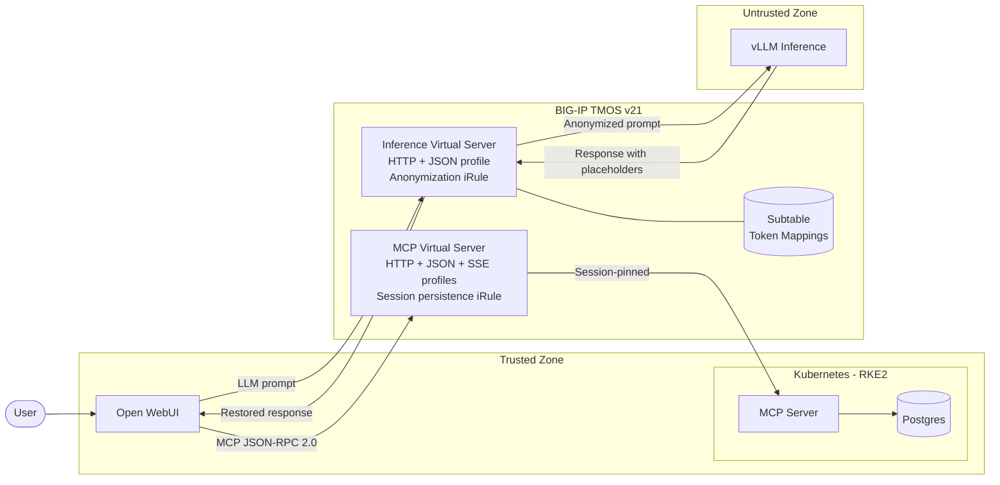
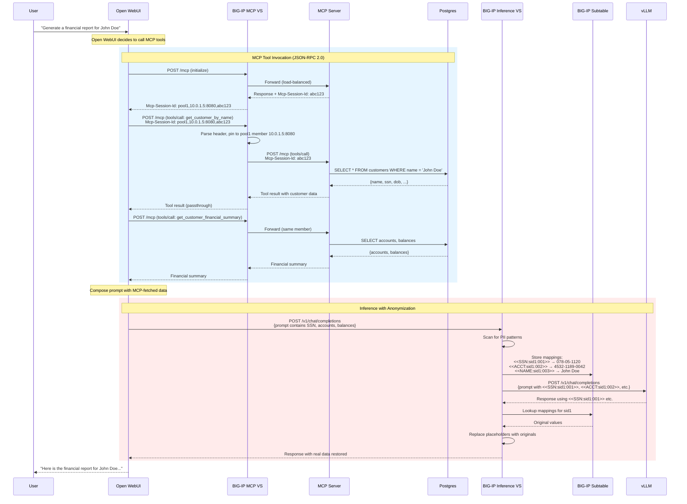
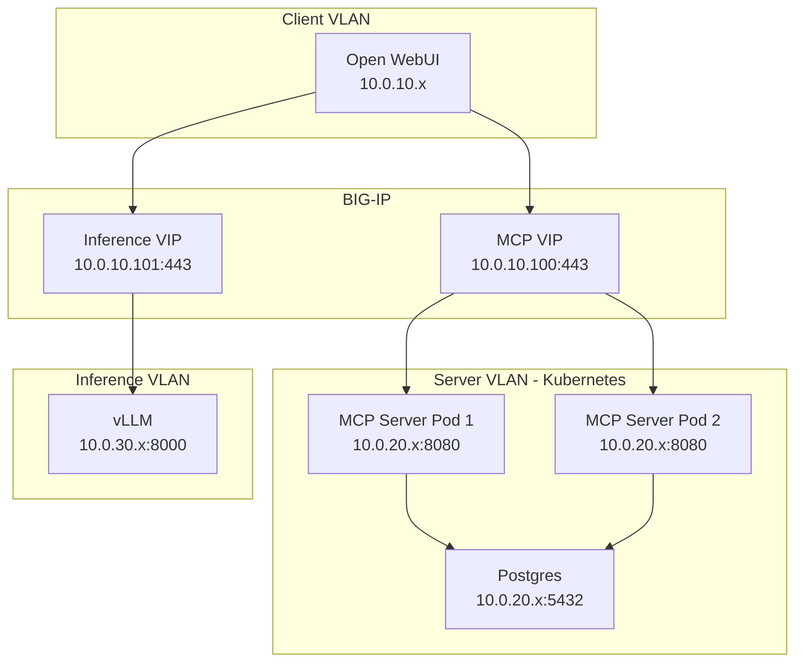

# Architecture

## Component Diagram

## Sequence Diagram — End-to-End Flow

## Network Topology

## Trust Boundaries

| Zone | Components | Sees PII? |
|---|---|---|
| Client | User, Open WebUI | Yes |
| MCP (Trusted) | BIG-IP MCP VS, MCP Server, Postgres | Yes |
| Inference (Untrusted) | vLLM | **No** — only placeholders |
| Control Plane | BIG-IP (both VS + subtable) | Yes (enforcement point) |
