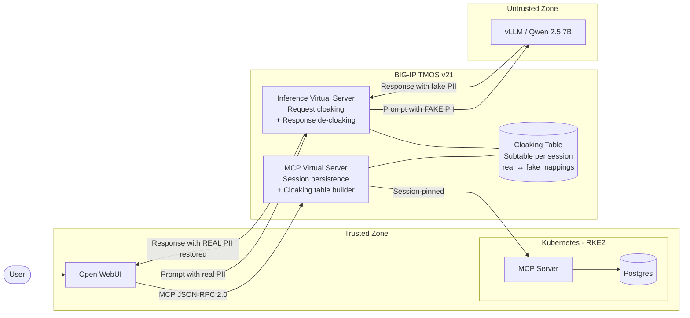
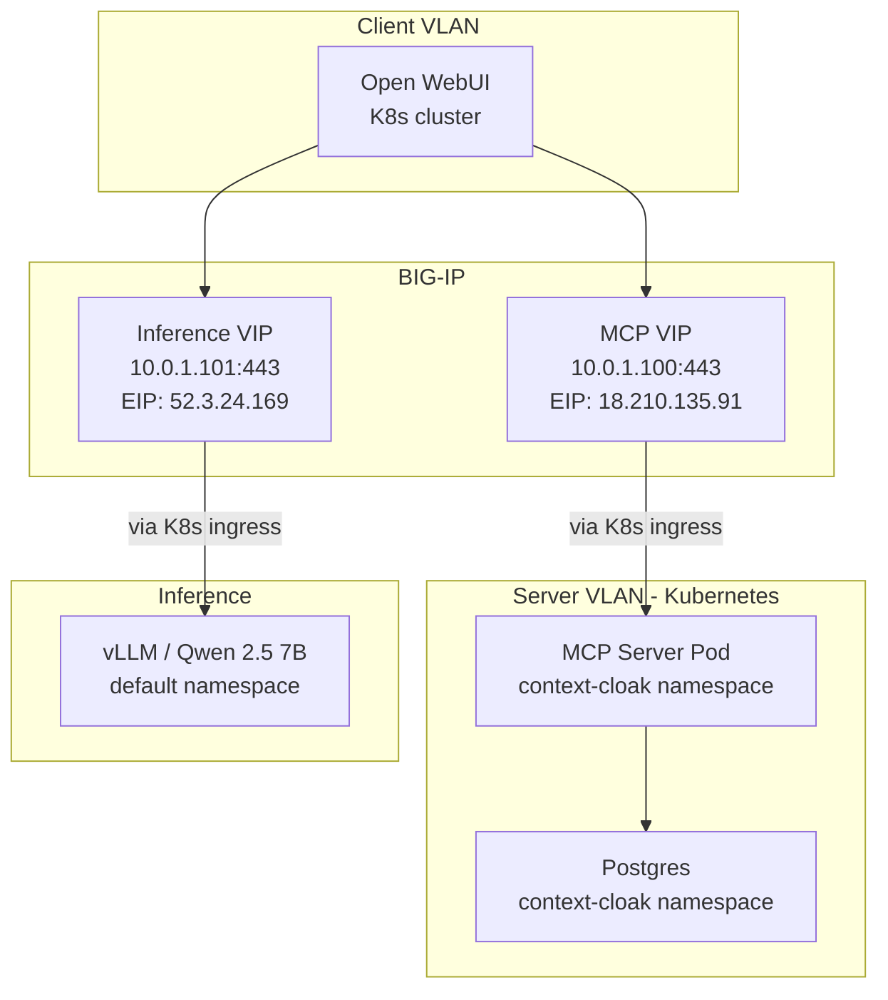

# Architecture

## Why Substitution, Not Masking or Tokenization

There are three common approaches to hiding sensitive data from an LLM. Context Cloak uses the third — and this section explains why.

### Approach 1: Masking (redaction)

Replace PII with asterisks or `[REDACTED]` markers:

```
"Generate a report for ******* with SSN ***-**-**** and account ****-****-****"
```

**Why it fails:** The LLM can't reason about data it can't see. It can't format an SSN it doesn't have, can't reference an account number in a summary, and can't distinguish between two redacted customers in the same prompt. The output is generic and useless for the analyst's actual task.

### Approach 2: Tokenization (placeholders)

Replace PII with structured tokens like `<<SSN:abc123:001>>`:

```
"Generate a report for <<NAME:abc123:001>> with SSN <<SSN:abc123:002>>"
```

**Why it fails:** The LLM knows these aren't real values. It may:
- Hallucinate around them ("I notice the SSN appears to be a placeholder...")
- Refuse to process them ("I can't generate a report with masked data")
- Produce awkward output that includes the raw tokens
- Break formatting, validation, and calculation logic

The model's behavior changes because the data *looks* fake.

### Approach 3: Substitution (Context Cloak's approach)

Replace PII with **realistic fake values** that are structurally identical:

```
"Generate a report for Maria Garcia with SSN 523-50-6675 and account 7865-4412-3375"
```

**Why it works:** The LLM has no idea the data is fake. "Maria Garcia" looks like a real name. "523-50-6675" looks like a real SSN. The model reasons about it naturally — formatting, calculations, report generation, validation — everything works exactly as it would with real data. The model's behavior is identical because the data *looks* real.

This is conceptually similar to a **substitution cipher** — every real value maps to a consistent fake value within the session, and the mapping is reversed on the way back. It's also the same principle behind [James Veitch's famous approach to messing with email scammers](https://www.ted.com/talks/james_veitch_this_is_what_happens_when_you_reply_to_spam_email) — swap "bank account" for "candy" and the scammer doesn't realize they're negotiating over gummy bears instead of wire transfers. The structure of the conversation is preserved; only the sensitive nouns change.

### The key insight: extract from structure, substitute with string map

The cloaking table is populated by reading **structured MCP tool responses** (JSON with known field names like `full_name`, `ssn`, `account_number`). This is deterministic — we know exactly what's PII because we know the schema.

The substitution is applied using **exact string matching** (`[string map]` in Tcl) on the inference request/response. No regex scanning of arbitrary text. No pattern matching that might false-positive. Just: "find this exact string, replace with that exact string."

This separation — structured extraction, exact substitution — gives us the reliability of field-level parsing with the simplicity of text replacement.

## Data Flow

```
┌──────────┐     ┌──────────────┐     ┌────────────────────────┐     ┌────────────┐     ┌──────────┐
│          │     │              │     │   BIG-IP MCP VS        │     │            │     │          │
│  User    ├────►│  Open WebUI  ├────►│   - Session persist    ├────►│ MCP Server ├────►│ Postgres │
│          │     │              │     │   - Build cloak table  │     │            │     │          │
└──────────┘     │              │     │   - Pass data through  │     └────────────┘     └──────────┘
                 │              │     └────────────────────────┘
                 │  (has real   │
                 │   PII data)  │     ┌────────────────────────┐     ┌──────────┐
                 │              ├────►│   BIG-IP Inference VS  ├────►│  vLLM    │
                 │              │     │   - Cloak request      │     │ (Qwen)   │
                 │              │◄────┤     real → fake        │◄────┤          │
                 │              │     │   - Decloak response   │     │ sees only│
                 └──────────────┘     │     fake → real        │     │ fake PII │
                                      └────────────────────────┘     └──────────┘
```

### Step by step

1. **User asks:** "Look up John Doe and show his transactions"
2. **Open WebUI** calls MCP tools through BIG-IP MCP VS
3. **MCP VS** forwards to MCP server, receives response with real PII
4. **MCP VS scans the response** — extracts PII from known JSON fields (`full_name`, `ssn`, `account_number`, `phone`, `email`), generates deterministic fakes, stores bidirectional mappings in a session-keyed subtable. **Response passes through unmodified.**
5. **Open WebUI** receives real data. Tool chaining works because the data is real.
6. **Open WebUI** composes a prompt with the real PII and sends to vLLM through BIG-IP Inference VS
7. **Inference VS REQUEST:** looks up the cloaking table, replaces all real PII with fakes using `[string map]`. vLLM receives: "Maria Garcia", "523-50-6675", "7865-4412-3375"
8. **vLLM generates** a response using the fake data — it has no idea it's fake
9. **Inference VS RESPONSE:** looks up the cloaking table, replaces all fakes back to reals using `[string map]`. User receives: "John Doe", "078-05-1120", "4532-1189-0042"

### Why the MCP response passes through unmodified

Earlier iterations of this project cloaked the MCP response before it reached Open WebUI. This broke **tool chaining** — when the LLM tried to call `get_accounts("Alice Johnson")`, the MCP server returned "not found" because Alice Johnson doesn't exist in the database.

By passing real data through the MCP path and cloaking only at the inference boundary, tool chaining works naturally. Open WebUI has real data to compose its prompts, and the BIG-IP swaps it out at the last moment before it hits the LLM.

## Component Diagram



## Cloaking Table Structure

The cloaking table is a BIG-IP subtable, one per session, with a configurable TTL (default 1 hour).

```
Subtable: cloak_<session_id>

  Key                          Value               Purpose
  ─────────────────────────    ──────────────────   ──────────────────────────────
  r2f_John Doe                 Maria Garcia         Real-to-fake (used on inference request)
  f2r_Maria Garcia             John Doe             Fake-to-real (used on inference response)
  r2f_078-05-1120              523-50-6675          SSN mapping
  f2r_523-50-6675              078-05-1120
  r2f_4532-1189-0042           7865-4412-3375       Account mapping
  f2r_7865-4412-3375           4532-1189-0042
  _real_list                   John Doe|            Index of all real values
                               078-05-1120|         (pipe-delimited, used by
                               4532-1189-0042       Inference VS to cloak requests)
  _fake_list                   Maria Garcia|        Index of all fake values
                               523-50-6675|         (pipe-delimited, used by
                               7865-4412-3375       Inference VS to decloak responses)
```

### Session ID derivation

Both the MCP VS and Inference VS derive the session ID the same way:
1. `X-Cloak-Session` header if present (preferred)
2. Client IP address (fallback — works when both VS see the same source IP)

### Fake value generation

| PII Type       | Generation Strategy                              | Example                     |
|----------------|--------------------------------------------------|-----------------------------|
| Name           | Deterministic pick from 10x10 fake name pool     | John Doe → Maria Garcia     |
| SSN            | Shift each digit by +5 mod 10                    | 078-05-1120 → 523-50-6675   |
| Phone          | Shift each digit by +4 mod 10                    | 217-555-0142 → 651-999-4586 |
| Email          | Hash-picked name + @example.net                  | john@email.com → maria.garcia@example.net |
| Account number | Shift each digit by +3 mod 10                    | 4532-1189-0042 → 7865-4412-3375 |

Dollar amounts, transaction descriptions, dates, and other non-identifying fields are **not cloaked** — they don't identify a person.

## iRule Architecture

### MCP VS iRule (`mcp_session_persistence`)

**HTTP_REQUEST:** MCP session persistence — Mcp-Session-Id header enrichment, pool member pinning

**HTTP_RESPONSE:** Mcp-Session-Id enrichment, SSE endpoint injection, body collection (uses `rechunk` HTTP profile to de-chunk SSE responses)

**HTTP_RESPONSE_DATA:** Cloaking table builder — scans the response body for known PII field names (`full_name`, `customer_name`, `ssn`, `phone`, `email`, `account_number`), generates fake values, stores bidirectional mappings. **Does not modify the response.**

### Inference VS iRule (`vllm_anonymization`)

**HTTP_REQUEST:** Collects request body for cloaking

**HTTP_REQUEST_DATA:** Cloaking — looks up `_real_list` from the session's cloaking table, builds `[string map]` of real→fake pairs sorted by length (longest first), applies to the request body. vLLM receives only fake PII.

**HTTP_RESPONSE:** Collects response body for de-cloaking

**HTTP_RESPONSE_DATA:** De-cloaking — looks up `_fake_list`, builds `[string map]` of fake→real pairs sorted by length, applies to the response body. User receives real PII.

## Network Topology



## Trust Boundaries

| Zone | Components | Sees Real PII? |
|---|---|---|
| MCP Server + Postgres | Source of truth | Yes |
| BIG-IP (Enforcement) | MCP VS + Inference VS + Cloaking Table | Yes — performs the swap |
| Open WebUI | Chat UI, MCP orchestration | Yes — receives real data from MCP |
| vLLM / Qwen (Untrusted) | LLM inference | **No — only sees fake data** |

The LLM is the only component in the pipeline that never sees real PII. Every other component in the trusted zone handles real data. The BIG-IP is the enforcement boundary that ensures the swap happens transparently.
