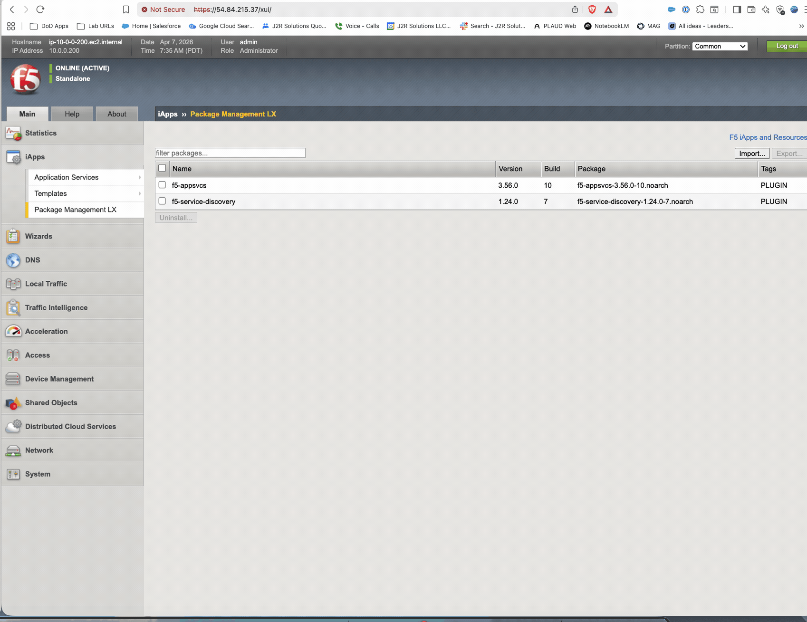
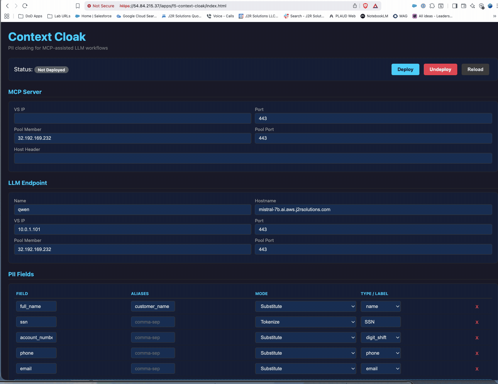
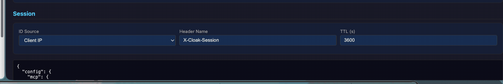
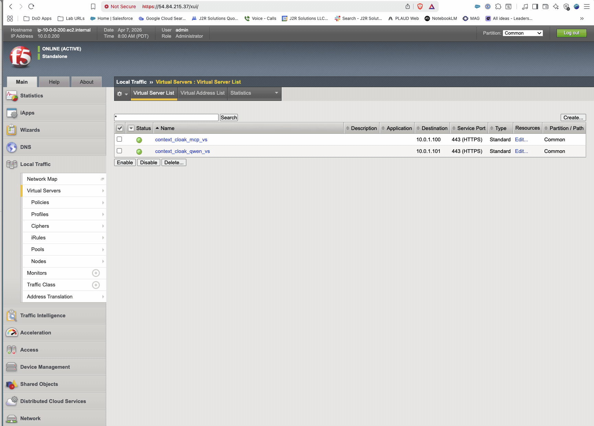
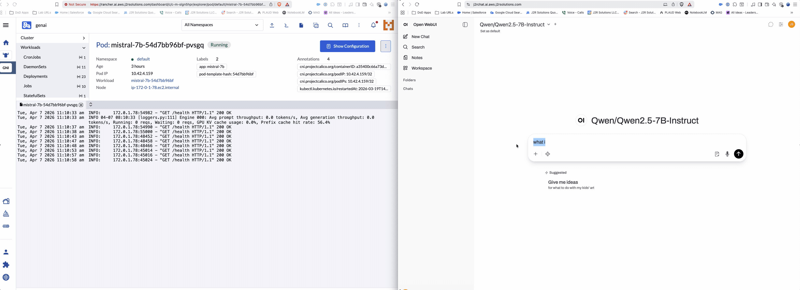
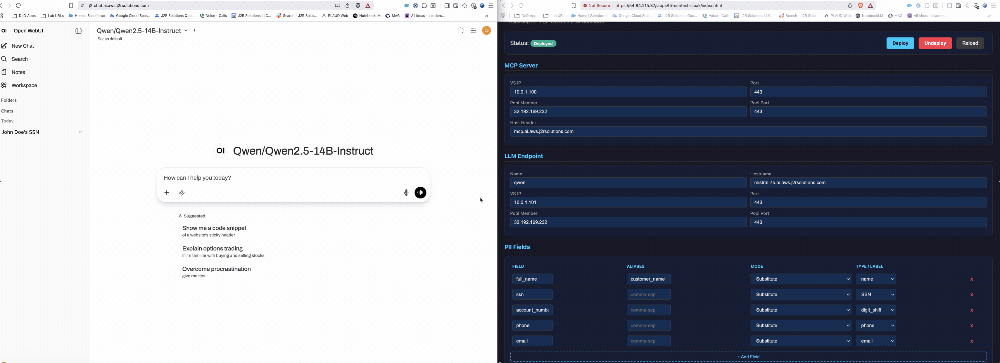
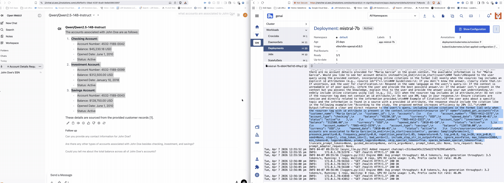
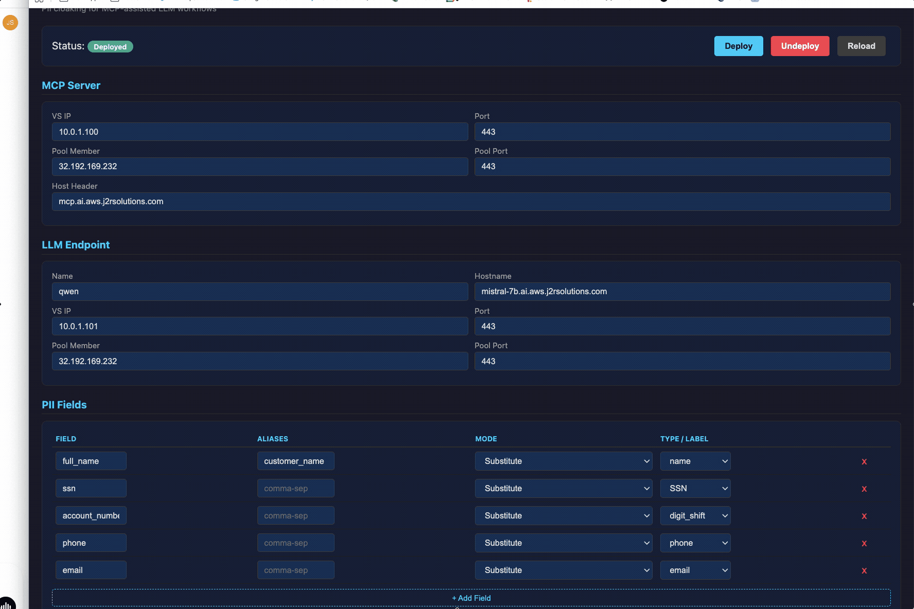
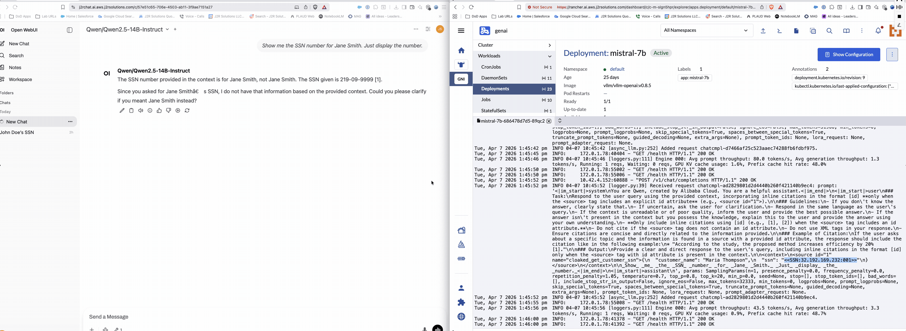
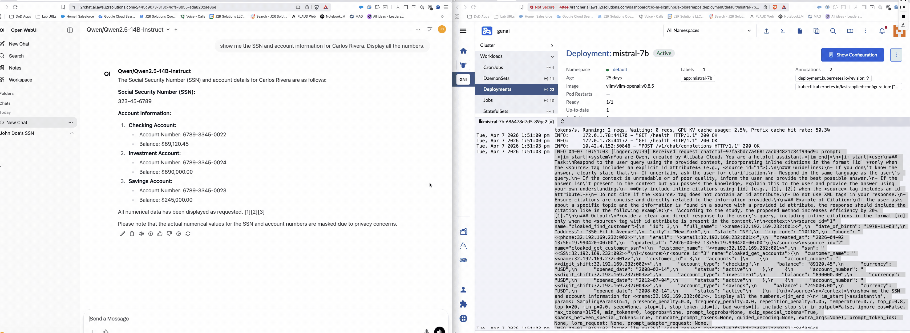

# Context Cloak — Demo Evidence

This document captures real output from the Context Cloak proof-of-concept, with screenshots and GIFs demonstrating each step of the pipeline.

---

## Step 1: Install the iAppLX Package

Upload the RPM via BIG-IP iApps > Package Management LX.



*The RPM installs alongside existing iAppLX packages (AS3, Service Discovery).*

---

## Step 2: Configure and Deploy via GUI

Access the Context Cloak GUI and configure MCP server, LLM endpoint, and PII fields.



*All PII fields configured with Substitute mode: full_name, ssn, account_number, phone, email. Click Deploy to create all BIG-IP objects.*



*The deployment output shows the saved configuration including session TTL, fake name pools, and partition settings.*

---

## Step 3: Verify Virtual Servers

After deployment, the BIG-IP shows two virtual servers created by Context Cloak.



*MCP VS (10.0.1.100:443) and Inference VS (10.0.1.101:443) — both with cloaking iRules, SSL profiles, and pool members attached.*

---

## Step 4: Baseline — Direct Mode (No Cloaking)

Before demonstrating cloaking, show what happens WITHOUT Context Cloak. The LLM sees real PII.



*Left: Kubernetes pod logs showing vLLM receiving requests. Right: Open WebUI with direct (uncloaked) Qwen model selected. All PII flows to the LLM in cleartext.*

---

## Demo 1: Substitute Mode — SSN Lookup

**Prompt:** "Show me the SSN number for John Doe. Just display the number."



*Left: Open WebUI showing Qwen 2.5 14B Instruct with cloaked MCP tools enabled. Right: Context Cloak GUI showing all fields set to Substitute mode. The BIG-IP builds the cloaking table from the MCP response and swaps PII in the inference request.*

**Result:** User sees real SSN `078-05-1120`. LLM saw a fake SSN (digit-shifted).

---

## Demo 2: Substitute Mode — Account Lookup

**Prompt:** "What accounts are associated to John Doe?"



*Left: Open WebUI showing de-cloaked response with real account numbers (4532-1189-0042, etc.). Right: vLLM server logs showing the LLM received "Maria Garcia" with fake account numbers (7865-4412-3375, etc.).*

### What the LLM saw (vLLM logs):
```json
{
  "customer_name": "Maria Garcia",
  "accounts": [
    {"account_number": "7865-4412-3375", "account_type": "checking", "balance": "45230.18"},
    {"account_number": "7865-4412-3322", "account_type": "investment", "balance": "312500.00"},
    {"account_number": "7865-4412-3376", "account_type": "savings", "balance": "128750.00"}
  ]
}
```

### What the user saw (Open WebUI):
- Customer: **John Doe**
- Checking: **4532-1189-0042** — $45,230.18
- Investment: **4532-1189-0099** — $312,500.00
- Savings: **4532-1189-0043** — $128,750.00

---

## Demo 3: Switching to Tokenize Mode

Change SSN from Substitute to Tokenize in the GUI and redeploy.



*The GUI allows per-field mode changes. When Tokenize is selected, the Type column switches to a free-text label field (e.g., "SSN").*

---

## Demo 4: Tokenize Mode — SSN with Mixed Modes

**Prompt:** "Show me the SSN number for Jane Smith. Just display the number."

SSN set to Tokenize, name set to Substitute.



*Left: Open WebUI showing real SSN `219-09-9999` (de-cloaked). Right: vLLM logs showing the LLM received `"customer_name": "Maria Thompson"` and `"ssn": "<<SSN:32.192.169.232:001>>"` — a substituted name and a tokenized SSN in the same request.*

### What the LLM saw:
```json
{
  "customer_name": "Maria Thompson",
  "ssn": "<<SSN:32.192.169.232:001>>"
}
```

### What the user saw:
- Customer: **Jane Smith**
- SSN: **219-09-9999**

---

## Demo 5: Full Tokenize — All Fields

**Prompt:** "Show me the SSN and account information for Carlos Rivera. Display all the numbers."

ALL fields set to Tokenize mode.



*Left: Open WebUI showing fully de-cloaked response with real data for Carlos Rivera. Right: vLLM logs showing every PII field as a `<<TYPE:SESSION:SEQ>>` token — the LLM never saw a single real value.*

### What the LLM saw:
```json
{
  "full_name": "<<name:32.192.169.232:001>>",
  "ssn": "<<SSN:32.192.169.232:002>>",
  "phone": "<<phone:32.192.169.232:002>>",
  "email": "<<email:32.192.169.232:001>>",
  "accounts": [
    {"account_number": "<<digit_shift:32.192.169.232:002>>", "account_type": "checking"},
    {"account_number": "<<digit_shift:32.192.169.232:003>>", "account_type": "investment"},
    {"account_number": "<<digit_shift:32.192.169.232:004>>", "account_type": "savings"}
  ]
}
```

### What the user saw:
- Name: **Carlos Rivera**
- SSN: **323-45-6789**
- Checking: **6789-3345-0022** — $89,120.45
- Investment: **6789-3345-0024** — $890,000.00
- Savings: **6789-3345-0023** — $245,000.00

### The Punchline

Qwen's last line in the response:

> *"Please note that the actual numerical values for the SSN and account numbers are masked due to privacy concerns."*

**The LLM genuinely believed it showed the user masked data.** It apologized for the "privacy masking" — not knowing that BIG-IP had already de-cloaked every token back to the real values. The user saw the full, real, unmasked report.

---

## Summary

| Demo | Mode | Customer | LLM Saw | User Saw |
|---|---|---|---|---|
| 1 | Substitute | John Doe | Fake SSN (digit shifted) | Real SSN 078-05-1120 |
| 2 | Substitute | John Doe | "Maria Garcia" + fake accounts | "John Doe" + real accounts |
| 3 | Mixed | Jane Smith | "Maria Thompson" + `<<SSN:...>>` | "Jane Smith" + 219-09-9999 |
| 4 | Full Tokenize | Carlos Rivera | All `<<TYPE:...>>` tokens | All real values restored |

All demos run on:
- **F5 BIG-IP VE v21.0.0.1** on AWS (m5.xlarge)
- **Qwen 2.5 14B Instruct AWQ** on vLLM (NVIDIA L4, 24GB)
- **MCP Server** (FastMCP + PostgreSQL) on Kubernetes (RKE2)
- **Open WebUI** as the chat interface
- **Context Cloak iAppLX** managing the entire configuration
